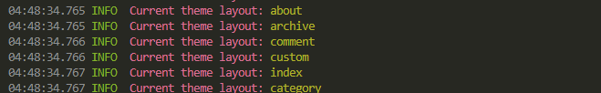
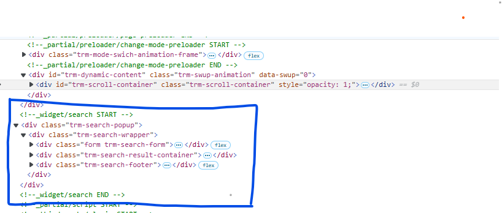

# hexo layout

Hexo-Layout 允许用户在**不修改**主题**源码**情况下对主题局部模板进行替换.

## 安装

node 版本要求 >= v14

```cmd
npm install hexo-layout --save
```

## 配置

将配置写入站点的配置文件 \_config.yml 里(不是主题的配置文件).

配置主要需要修改是 custom 字段, 建立原模板与新模板关系

```yml
layout:
  path: layout # 自定义模板存放文件夹, 相对于根目录
  prefix: _hexo_layout_ # 模板名称前缀, 避免与原主题中模板命名冲突
  custom:
    原模版: 新模板
```

## 使用

参考 [在线使用示例](https://stackblitz.com/edit/node-bqs8oq?file=README.md)

举例:

原主题存在 \_widget/archive 模块, 想要替换掉, 修改配置如下

```yml
layout:
  custom:
    _widget/archive: archive
```

在 layout 目录下添加 archive.ejs (也可以时任何其他渲染器支持类型文件: archive.pug archive.html 等), 在 archive.ejs 里写入新的模板即可

```
┌── blog
│   └── layout
│          └── archive.ejs
│   └── scaffolds
│   └── source
```

#### 在新的模板里引入原 archive 模块 使用方式

插件加载后, 原模版 会被替换成 我们自定义的模板, 我们自定义的模板 会 存在原模板, 所以要替换后的原模版 只需要按新的自定义模板路径加载即可

新的自定义模板路径规则 = prefix + 模板到 layout 文件夹相对路径

默认 prefix 值为 **_hexo_layout_** , 新的自定义模板路径为 **_hexo_layout_/archive**

```ejs
  <%- partial('_hexo_layout_/archive') %>
```

#### 在新的模板引入自定义其他模板 使用方式

在自定义模板中 也是可以引入其他自定义模板的, 在上面基础上添加个 othre.ejs

```
┌── blog
│   └── layout
│          └── archive.ejs
│          └── othre.ejs
│   └── scaffolds
│   └── source
```

在 archive.ejs 引入 othre.ejs , 路径规则和上面一样 (prefix + 模板到 layout 文件夹相对路径)

```ejs
  <%- partial('_hexo_layout_/othre') %>
```

## 查看主题模板

在 hexo server 后添加 --showlayout 参数, 会打印出当前主题注册的模板名称

```cmd
hexo server --showlayout
```



在 devtools 可以看到添加注释信息, 通过注释标签查看 对应模块 生成的 HTML

\<\!--模块名 START --> 生成 HTML \<\!--模块名 END -->



# Lisense

MIT
